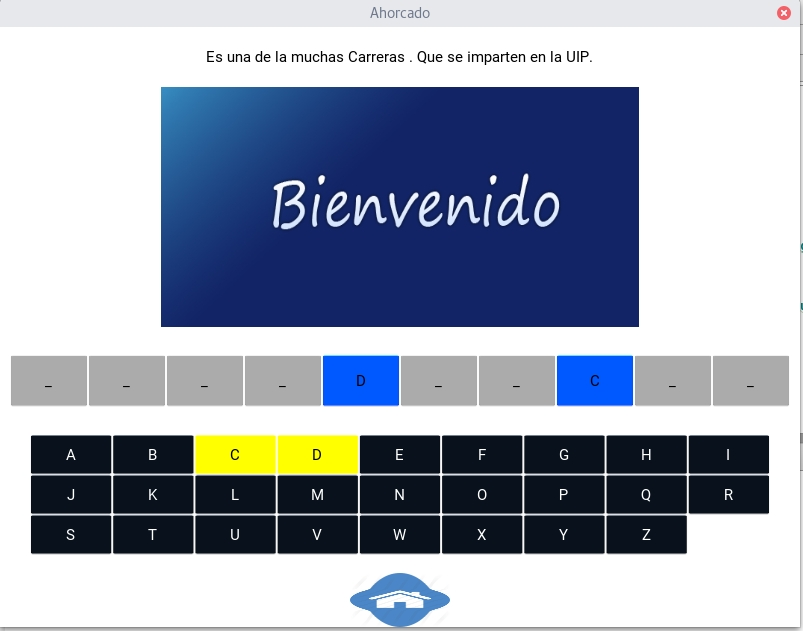

## UIP Juego Ahorcado

Juego del ahoracado Bastante interactivo con sonido y efectos incluidos.
El Desarrollo realizado con framework  pyhton-kivy. 

# Pantalla principal:

# Pantalla de inicio del ahorcado:
           
                       
                       
## Licencia
El código de este repositorio está bajo la licencia MIT (ver archivo LICENSE).